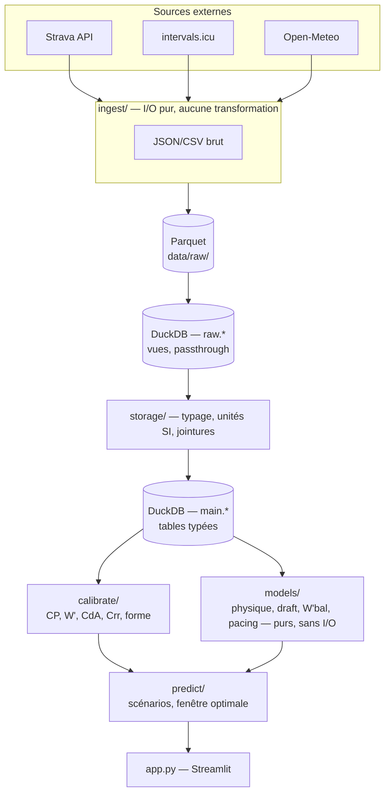

# Kompass — prédicteur de temps sur segment Strava

Prédit le temps réalisable sur un segment Strava donné à partir d'un
modèle physique du cycliste (courbe de puissance, aérodynamique,
draft), calibré sur mon propre historique Strava, croisé avec la
météo prévue sur 10 jours pour recommander la meilleure fenêtre — avec
un intervalle d'incertitude, pas un chiffre unique pris pour argent
comptant.

Projet solo, mono-utilisateur, construit ticket par ticket (`ROADMAP.md`)
comme projet d'apprentissage et de portfolio — voir `CLAUDE.md` pour le
contexte complet et les conventions, `docs/ENGINEERING_NOTES.md` pour le
détail technique de chaque décision, ticket par ticket.

## Ce que ça fait

1. Récupère l'historique Strava (activités, streams de puissance,
   segments favoris) et les données intervals.icu/Open-Meteo associées.
2. Calibre un modèle physique du cycliste (Critical Power, CdA, Crr) sur
   les efforts solo, proches du maximum, de l'historique réel.
3. Simule le temps sur un segment donné, avec vent et draft.
4. Compare 10 jours de prévision météo créneau par créneau et recommande
   la meilleure fenêtre, avec un intervalle d'incertitude Monte-Carlo.
5. Optimise un profil de puissance variable par programmation dynamique.
6. Expose tout ça dans une interface Streamlit.

## Architecture



Règle d'architecture centrale : `ingest/` ne transforme rien, `models/`
ne fait aucun I/O (fonctions pures, testables sans base de données ni
réseau). Le Parquet brut est la seule source de vérité — la base DuckDB
entière se reconstruit à l'identique par
`uv run python scripts/build_database.py`, sans appel réseau.

## Décisions techniques qui comptent

- **Physique, pas boîte noire.** Le temps prédit sort d'une équation de
  puissance cycliste (gravité + roulement + aérodynamique, résolue par
  Brent) et d'un modèle Critical Power à 2 paramètres — pas d'un modèle
  de machine learning entraîné sur mes propres sorties, qui apprendrait
  aussi bien mes trajets que ma vitesse.
- **Calibration sur les seuls efforts pertinents, pas tout l'historique.**
  CdA/Crr sont ajustés sur les efforts solo, proches d'un record personnel
  (`pr_rank`), dans la plage de validité du modèle CP — inclure un effort
  d'entraînement tranquille biaiserait la calibration vers un modèle trop
  conservateur, pas vers "mon CdA réel".
- **Découpage temporel partout où l'ordre chronologique compte** (backtest
  T-18, validation croisée du modèle de forme T-24) : jamais un split
  aléatoire, qui mélangerait passé et futur et donnerait une erreur
  artificiellement optimiste.
- **Aucune dépendance ajoutée sans raison explicite.** Ridge regression
  (T-24) et Monte-Carlo (T-28) sont codés à la main avec numpy/scipy,
  déjà présents dans le projet, plutôt que d'ajouter scikit-learn pour
  quelques lignes d'algèbre linéaire.
- **Une prévision météo n'est jamais persistée** (T-27) — contrairement
  à toutes les autres sources de données, un forecast devient faux en
  quelques heures ; le persister casserait l'invariant "la base se
  reconstruit à l'identique depuis le Parquet".
- **Aucune valeur inventée quand une donnée manque.** Une exception
  explicite plutôt qu'un défaut silencieux (segment mal formé, effort
  hors plage de validité, forme insuffisante pour l'incertitude...).

## Résultats (sur mes propres données réelles)

| Composant | Résultat |
|---|---|
| Calibration CdA/Crr (T-17) | CdA=0.441 m², Crr=0.0105, erreur relative 8.7% (n=77) |
| Backtest temporel (T-18) | erreur absolue médiane 14.9 s (15 efforts de test) |
| Gain de draft, plat vs montée (T-19/20) | 47% (plat) contre 9% (montée à 6.7%) |
| Indice de performance (T-23) | 225 points, 2021-2026 |
| Modèle de forme (T-24) | **R² = -3.47 en validation croisée temporelle** — négatif, diagnostiqué et documenté plutôt que caché (voir `docs/ENGINEERING_NOTES.md`) |
| Pacing optimal vs puissance constante (T-26) | 10% de gain sur un segment vallonné synthétique |
| Prévision + incertitude (T-27/28) | `Temps prédit : 5:15 ± 9s` sur un vrai segment |

Le R² négatif de T-24 n'est pas caché : c'est le résultat honnête d'une
vraie validation temporelle, avec sa cause diagnostiquée (dérive de
l'indice de performance dans le temps, effet mécanique d'un CP fixe
utilisé comme référence). Un chiffre optimiste obtenu en croisant les
données au hasard aurait été plus flatteur et faux.

## Limites connues (principales)

- Aucun segment n'a de profil tronçon par tronçon stocké — traité comme
  un seul tronçon à pente/cap moyens partout (calibration, pacing,
  prévision).
- Le vent n'était pas branché au moment de la calibration CdA/Crr (T-17) ;
  pas recalibré depuis.
- L'incertitude météo (T-28) repose sur une hypothèse assumée (±20% sur
  le vent), pas mesurée contre un historique prévision-vs-réalisé.

Détail complet, avec le raisonnement de chaque décision : `docs/ENGINEERING_NOTES.md`.

## Stack

Python 3.12, `uv`, DuckDB + Parquet, `httpx`, `numpy`/`scipy`,
`matplotlib`, `pytest`, `ruff`, Streamlit. Voir `CLAUDE.md` pour le
détail et les conventions.

## Commandes

```bash
uv sync                  # installer les dépendances
uv run pytest            # lancer les tests (plus de 300, tous verts)
uv run ruff check .      # lint
uv run streamlit run app.py   # interface
```
